# SWITCH System Architecture Document

## 1. Executive Summary
SWITCH employs a modern, testable Unity architecture using dependency injection, event-driven communication, and performance-optimized systems. The architecture prioritizes mobile performance, battery efficiency, and professional development patterns suitable for portfolio demonstration.

## 2. Architecture Overview

### 2.1 High-Level System Architecture
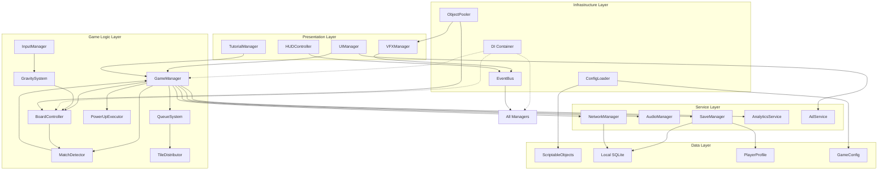
```mermaid
graph TB
    subgraph "Presentation Layer"
        UI[UIManager]
        VFX[VFXManager]
        TUT[TutorialManager]
        HUD[HUDController]
    end
    
    subgraph "Game Logic Layer"
        GM[GameManager]
        BC[BoardController]
        IM[InputManager]
        GS[GravitySystem]
        QS[QueueSystem]
        MD[MatchDetector]
        PE[PowerUpExecutor]
        TD[TileDistributor]
    end
    
    subgraph "Service Layer"
        SM[SaveManager]
        AM[AudioManager]
        NM[NetworkManager]
        AS[AnalyticsService]
        AD[AdService]
    end
    
    subgraph "Infrastructure Layer"
        DI[DI Container]
        OP[ObjectPooler]
        EB[EventBus]
        CL[ConfigLoader]
    end
    
    subgraph "Data Layer"
        SO[ScriptableObjects]
        DB[Local SQLite]
        PP[PlayerProfile]
        GC[GameConfig]
    end
    
    %% Presentation connections
    UI --> GM
    VFX --> EB
    TUT --> GM
    HUD --> EB
    
    %% Game Logic connections
    GM --> BC
    GM --> QS
    GM --> MD
    GM --> PE
    IM --> GS
    GS --> BC
    QS --> TD
    BC --> MD
    MD --> GM
    
    %% Service connections
    GM --> SM
    GM --> AM
    GM --> NM
    GM --> AS
    UI --> AD
    
    %% Infrastructure usage
    DI -.-> GM
    DI -.-> BC
    DI -.-> All[All Managers]
    OP --> BC
    OP --> VFX
    EB --> All
    CL --> SO
    
    %% Data connections
    SM --> DB
    SM --> PP
    CL --> GC
    NM --> DB
```

### 2.2 Component Interaction Flow
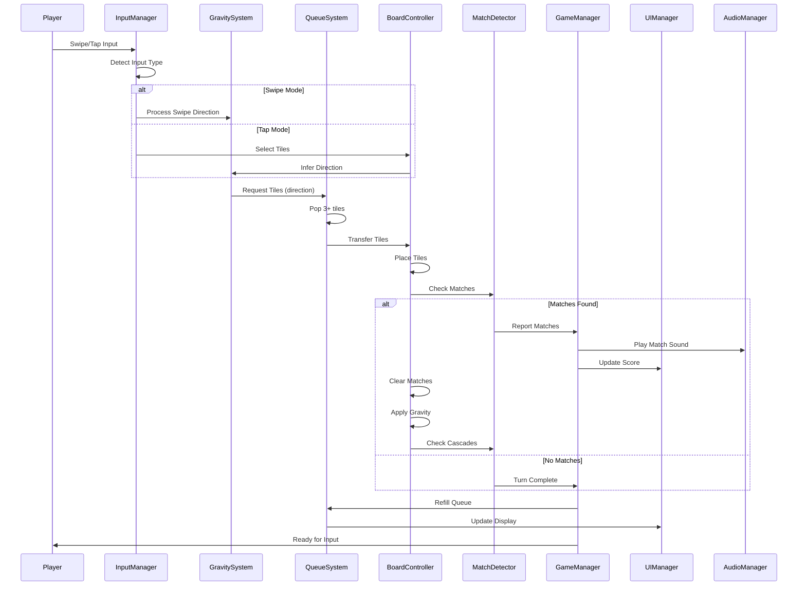
```mermaid
sequenceDiagram
    participant Player
    participant InputManager
    participant GravitySystem
    participant QueueSystem
    participant BoardController
    participant MatchDetector
    participant GameManager
    participant UIManager
    participant AudioManager
    
    Player->>InputManager: Swipe/Tap Input
    InputManager->>InputManager: Detect Input Type
    
    alt Swipe Mode
        InputManager->>GravitySystem: Process Swipe Direction
    else Tap Mode
        InputManager->>BoardController: Select Tiles
        BoardController->>GravitySystem: Infer Direction
    end
    
    GravitySystem->>QueueSystem: Request Tiles (direction)
    QueueSystem->>QueueSystem: Pop 3+ tiles
    QueueSystem->>BoardController: Transfer Tiles
    
    BoardController->>BoardController: Place Tiles
    BoardController->>MatchDetector: Check Matches
    
    alt Matches Found
        MatchDetector->>GameManager: Report Matches
        GameManager->>AudioManager: Play Match Sound
        GameManager->>UIManager: Update Score
        BoardController->>BoardController: Clear Matches
        BoardController->>BoardController: Apply Gravity
        BoardController->>MatchDetector: Check Cascades
    else No Matches
        MatchDetector->>GameManager: Turn Complete
    end
    
    GameManager->>QueueSystem: Refill Queue
    QueueSystem->>UIManager: Update Display
    GameManager->>Player: Ready for Input
```

## 3. Core Systems Architecture

### 3.1 GameManager - Central Orchestrator
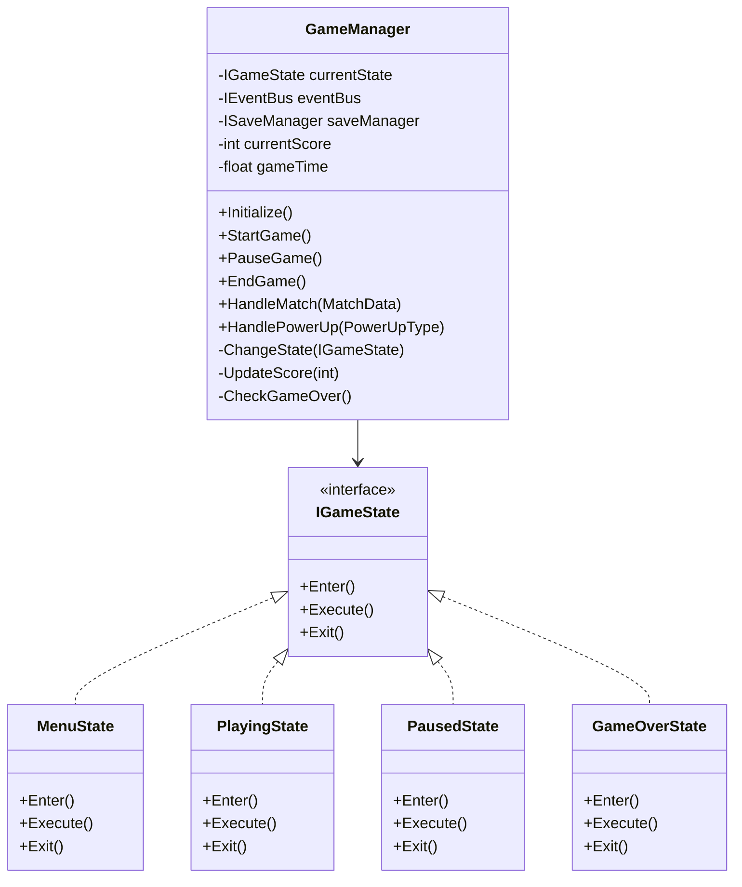
```mermaid
classDiagram
    class GameManager {
        -IGameState currentState
        -IEventBus eventBus
        -ISaveManager saveManager
        -int currentScore
        -float gameTime
        +Initialize()
        +StartGame()
        +PauseGame()
        +EndGame()
        +HandleMatch(MatchData)
        +HandlePowerUp(PowerUpType)
        -ChangeState(IGameState)
        -UpdateScore(int)
        -CheckGameOver()
    }
    
    class IGameState {
        <<interface>>
        +Enter()
        +Execute()
        +Exit()
    }
    
    class MenuState {
        +Enter()
        +Execute()
        +Exit()
    }
    
    class PlayingState {
        +Enter()
        +Execute()
        +Exit()
    }
    
    class PausedState {
        +Enter()
        +Execute()
        +Exit()
    }
    
    class GameOverState {
        +Enter()
        +Execute()
        +Exit()
    }
    
    GameManager --> IGameState
    IGameState <|.. MenuState
    IGameState <|.. PlayingState
    IGameState <|.. PausedState
    IGameState <|.. GameOverState
```

### 3.2 Input System Architecture
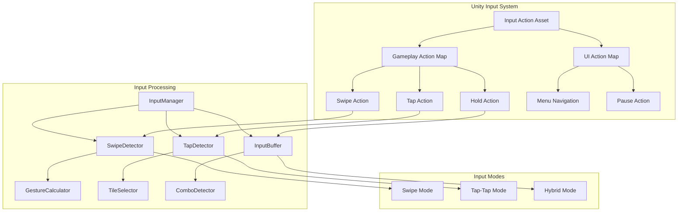
```mermaid
graph TD
    subgraph "Unity Input System"
        IA[Input Action Asset]
        IA --> GP[Gameplay Action Map]
        IA --> UI[UI Action Map]
        
        GP --> SW[Swipe Action]
        GP --> TP[Tap Action]
        GP --> HD[Hold Action]
        
        UI --> MN[Menu Navigation]
        UI --> PS[Pause Action]
    end
    
    subgraph "Input Processing"
        IM[InputManager]
        IM --> SD[SwipeDetector]
        IM --> TD[TapDetector]
        IM --> IB[InputBuffer]
        
        SD --> GC[GestureCalculator]
        TD --> TS[TileSelector]
        IB --> CB[ComboDetector]
    end
    
    subgraph "Input Modes"
        SM[Swipe Mode]
        TM[Tap-Tap Mode]
        HM[Hybrid Mode]
    end
    
    SW --> SD
    TP --> TD
    HD --> IB
    
    SD --> SM
    TD --> TM
    IB --> HM
```

### 3.3 Board & Tile System
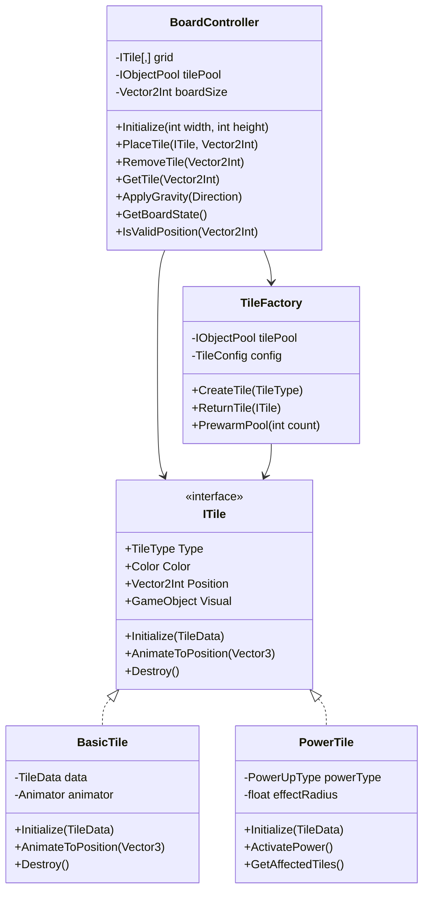
```mermaid
classDiagram
    class BoardController {
        -ITile[,] grid
        -IObjectPool tilePool
        -Vector2Int boardSize
        +Initialize(int width, int height)
        +PlaceTile(ITile, Vector2Int)
        +RemoveTile(Vector2Int)
        +GetTile(Vector2Int)
        +ApplyGravity(Direction)
        +GetBoardState()
        +IsValidPosition(Vector2Int)
    }
    
    class ITile {
        <<interface>>
        +TileType Type
        +Color Color
        +Vector2Int Position
        +GameObject Visual
        +Initialize(TileData)
        +AnimateToPosition(Vector3)
        +Destroy()
    }
    
    class BasicTile {
        -TileData data
        -Animator animator
        +Initialize(TileData)
        +AnimateToPosition(Vector3)
        +Destroy()
    }
    
    class PowerTile {
        -PowerUpType powerType
        -float effectRadius
        +Initialize(TileData)
        +ActivatePower()
        +GetAffectedTiles()
    }
    
    class TileFactory {
        -IObjectPool tilePool
        -TileConfig config
        +CreateTile(TileType)
        +ReturnTile(ITile)
        +PrewarmPool(int count)
    }
    
    BoardController --> ITile
    ITile <|.. BasicTile
    ITile <|.. PowerTile
    BoardController --> TileFactory
    TileFactory --> ITile
```

### 3.5 Input System Classes
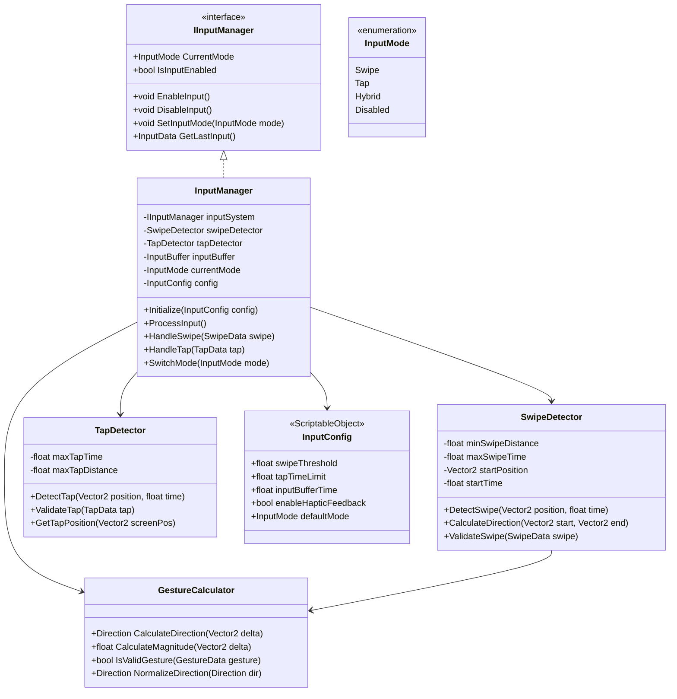
```mermaid
classDiagram
    class IInputManager {
        <<interface>>
        +InputMode CurrentMode
        +bool IsInputEnabled
        +void EnableInput()
        +void DisableInput()
        +void SetInputMode(InputMode mode)
        +InputData GetLastInput()
    }
    
    class InputManager {
        -IInputManager inputSystem
        -SwipeDetector swipeDetector
        -TapDetector tapDetector
        -InputBuffer inputBuffer
        -InputMode currentMode
        -InputConfig config
        +Initialize(InputConfig config)
        +ProcessInput()
        +HandleSwipe(SwipeData swipe)
        +HandleTap(TapData tap)
        +SwitchMode(InputMode mode)
    }
    
    class SwipeDetector {
        -float minSwipeDistance
        -float maxSwipeTime
        -Vector2 startPosition
        -float startTime
        +DetectSwipe(Vector2 position, float time)
        +CalculateDirection(Vector2 start, Vector2 end)
        +ValidateSwipe(SwipeData swipe)
    }
    
    class TapDetector {
        -float maxTapTime
        -float maxTapDistance
        +DetectTap(Vector2 position, float time)
        +ValidateTap(TapData tap)
        +GetTapPosition(Vector2 screenPos)
    }
    
    class GestureCalculator {
        +Direction CalculateDirection(Vector2 delta)
        +float CalculateMagnitude(Vector2 delta)
        +bool IsValidGesture(GestureData gesture)
        +Direction NormalizeDirection(Direction dir)
    }
    
    class InputConfig {
        <<ScriptableObject>>
        +float swipeThreshold
        +float tapTimeLimit
        +float inputBufferTime
        +bool enableHapticFeedback
        +InputMode defaultMode
    }
    
    class InputMode {
        <<enumeration>>
        Swipe
        Tap
        Hybrid
        Disabled
    }
    
    IInputManager <|.. InputManager
    InputManager --> SwipeDetector
    InputManager --> TapDetector
    InputManager --> GestureCalculator
    InputManager --> InputConfig
    SwipeDetector --> GestureCalculator
```

### 3.6 Queue System Classes
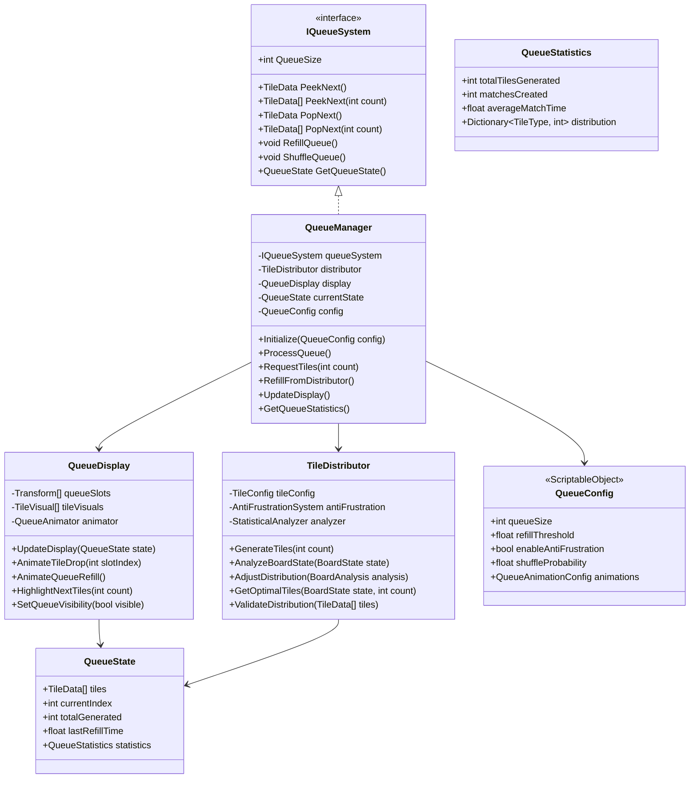
```mermaid
classDiagram
    class IQueueSystem {
        <<interface>>
        +int QueueSize
        +TileData PeekNext()
        +TileData[] PeekNext(int count)
        +TileData PopNext()
        +TileData[] PopNext(int count)
        +void RefillQueue()
        +void ShuffleQueue()
        +QueueState GetQueueState()
    }
    
    class QueueManager {
        -IQueueSystem queueSystem
        -TileDistributor distributor
        -QueueDisplay display
        -QueueState currentState
        -QueueConfig config
        +Initialize(QueueConfig config)
        +ProcessQueue()
        +RequestTiles(int count)
        +RefillFromDistributor()
        +UpdateDisplay()
        +GetQueueStatistics()
    }
    
    class QueueDisplay {
        -Transform[] queueSlots
        -TileVisual[] tileVisuals
        -QueueAnimator animator
        +UpdateDisplay(QueueState state)
        +AnimateTileDrop(int slotIndex)
        +AnimateQueueRefill()
        +HighlightNextTiles(int count)
        +SetQueueVisibility(bool visible)
    }
    
    class TileDistributor {
        -TileConfig tileConfig
        -AntiFrustrationSystem antiFrustration
        -StatisticalAnalyzer analyzer
        +GenerateTiles(int count)
        +AnalyzeBoardState(BoardState state)
        +AdjustDistribution(BoardAnalysis analysis)
        +GetOptimalTiles(BoardState state, int count)
        +ValidateDistribution(TileData[] tiles)
    }
    
    class QueueState {
        +TileData[] tiles
        +int currentIndex
        +int totalGenerated
        +float lastRefillTime
        +QueueStatistics statistics
    }
    
    class QueueConfig {
        <<ScriptableObject>>
        +int queueSize
        +float refillThreshold
        +bool enableAntiFrustration
        +float shuffleProbability
        +QueueAnimationConfig animations
    }
    
    class QueueStatistics {
        +int totalTilesGenerated
        +int matchesCreated
        +float averageMatchTime
        +Dictionary~TileType, int~ distribution
    }
    
    IQueueSystem <|.. QueueManager
    QueueManager --> TileDistributor
    QueueManager --> QueueDisplay
    QueueManager --> QueueConfig
    QueueDisplay --> QueueState
    TileDistributor --> QueueState
```

### 3.7 Match Detection Classes
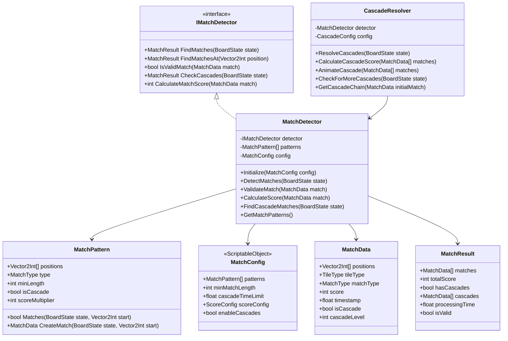
```mermaid
classDiagram
    class IMatchDetector {
        <<interface>>
        +MatchResult FindMatches(BoardState state)
        +MatchResult FindMatchesAt(Vector2Int position)
        +bool IsValidMatch(MatchData match)
        +MatchResult CheckCascades(BoardState state)
        +int CalculateMatchScore(MatchData match)
    }
    
    class MatchDetector {
        -IMatchDetector detector
        -MatchPattern[] patterns
        -MatchConfig config
        +Initialize(MatchConfig config)
        +DetectMatches(BoardState state)
        +ValidateMatch(MatchData match)
        +CalculateScore(MatchData match)
        +FindCascadeMatches(BoardState state)
        +GetMatchPatterns()
    }
    
    class MatchPattern {
        +Vector2Int[] positions
        +MatchType type
        +int minLength
        +bool isCascade
        +int scoreMultiplier
        +bool Matches(BoardState state, Vector2Int start)
        +MatchData CreateMatch(BoardState state, Vector2Int start)
    }
    
    class CascadeResolver {
        -MatchDetector detector
        -CascadeConfig config
        +ResolveCascades(BoardState state)
        +CalculateCascadeScore(MatchData[] matches)
        +AnimateCascade(MatchData[] matches)
        +CheckForMoreCascades(BoardState state)
        +GetCascadeChain(MatchData initialMatch)
    }
    
    class MatchData {
        +Vector2Int[] positions
        +TileType tileType
        +MatchType matchType
        +int score
        +float timestamp
        +bool isCascade
        +int cascadeLevel
    }
    
    class MatchResult {
        +MatchData[] matches
        +int totalScore
        +bool hasCascades
        +MatchData[] cascades
        +float processingTime
        +bool isValid
    }
    
    class MatchConfig {
        <<ScriptableObject>>
        +MatchPattern[] patterns
        +int minMatchLength
        +float cascadeTimeLimit
        +ScoreConfig scoreConfig
        +bool enableCascades
    }
    
    IMatchDetector <|.. MatchDetector
    MatchDetector --> MatchPattern
    MatchDetector --> MatchConfig
    CascadeResolver --> MatchDetector
    MatchDetector --> MatchData
    MatchDetector --> MatchResult
```

### 3.8 Gravity System Classes
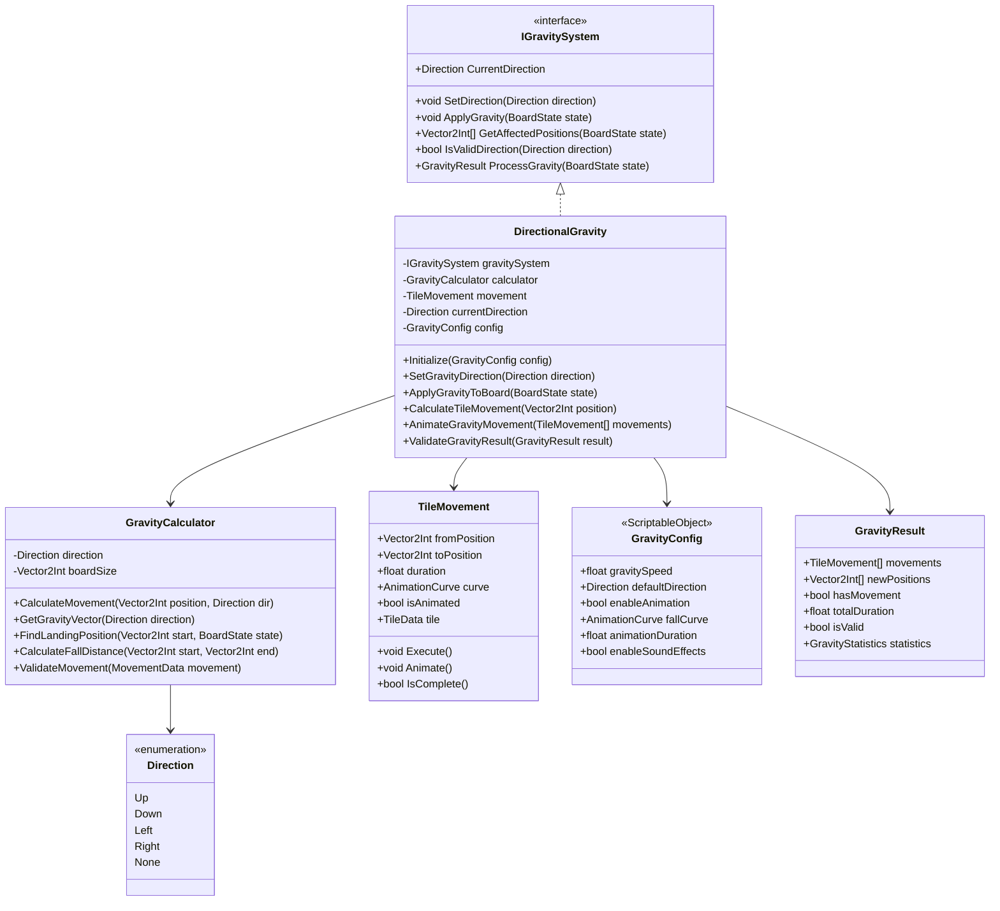
```mermaid
classDiagram
    class IGravitySystem {
        <<interface>>
        +Direction CurrentDirection
        +void SetDirection(Direction direction)
        +void ApplyGravity(BoardState state)
        +Vector2Int[] GetAffectedPositions(BoardState state)
        +bool IsValidDirection(Direction direction)
        +GravityResult ProcessGravity(BoardState state)
    }
    
    class DirectionalGravity {
        -IGravitySystem gravitySystem
        -GravityCalculator calculator
        -TileMovement movement
        -Direction currentDirection
        -GravityConfig config
        +Initialize(GravityConfig config)
        +SetGravityDirection(Direction direction)
        +ApplyGravityToBoard(BoardState state)
        +CalculateTileMovement(Vector2Int position)
        +AnimateGravityMovement(TileMovement[] movements)
        +ValidateGravityResult(GravityResult result)
    }
    
    class GravityCalculator {
        -Direction direction
        -Vector2Int boardSize
        +CalculateMovement(Vector2Int position, Direction dir)
        +GetGravityVector(Direction direction)
        +FindLandingPosition(Vector2Int start, BoardState state)
        +CalculateFallDistance(Vector2Int start, Vector2Int end)
        +ValidateMovement(MovementData movement)
    }
    
    class TileMovement {
        +Vector2Int fromPosition
        +Vector2Int toPosition
        +float duration
        +AnimationCurve curve
        +bool isAnimated
        +TileData tile
        +void Execute()
        +void Animate()
        +bool IsComplete()
    }
    
    class Direction {
        <<enumeration>>
        Up
        Down
        Left
        Right
        None
    }
    
    class GravityConfig {
        <<ScriptableObject>>
        +float gravitySpeed
        +Direction defaultDirection
        +bool enableAnimation
        +AnimationCurve fallCurve
        +float animationDuration
        +bool enableSoundEffects
    }
    
    class GravityResult {
        +TileMovement[] movements
        +Vector2Int[] newPositions
        +bool hasMovement
        +float totalDuration
        +bool isValid
        +GravityStatistics statistics
    }
    
    IGravitySystem <|.. DirectionalGravity
    DirectionalGravity --> GravityCalculator
    DirectionalGravity --> TileMovement
    DirectionalGravity --> GravityConfig
    GravityCalculator --> Direction
    DirectionalGravity --> GravityResult
```

### 3.9 Data Structures
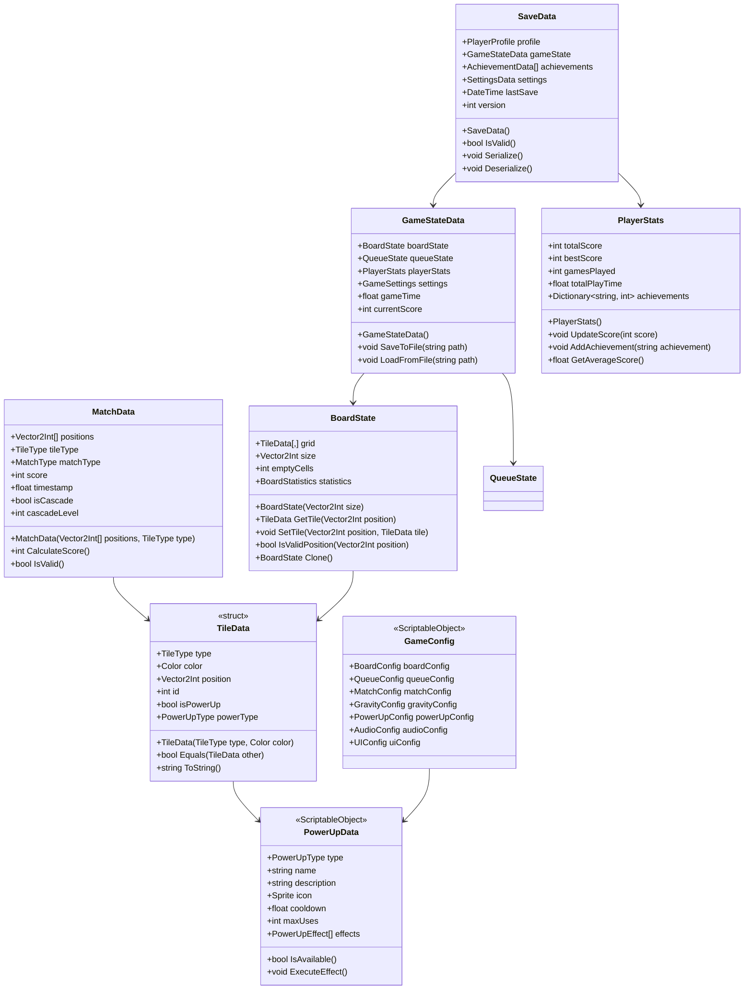
```mermaid
classDiagram
    class TileData {
        <<struct>>
        +TileType type
        +Color color
        +Vector2Int position
        +int id
        +bool isPowerUp
        +PowerUpType powerType
        +TileData(TileType type, Color color)
        +bool Equals(TileData other)
        +string ToString()
    }
    
    class MatchData {
        +Vector2Int[] positions
        +TileType tileType
        +MatchType matchType
        +int score
        +float timestamp
        +bool isCascade
        +int cascadeLevel
        +MatchData(Vector2Int[] positions, TileType type)
        +int CalculateScore()
        +bool IsValid()
    }
    
    class PowerUpData {
        <<ScriptableObject>>
        +PowerUpType type
        +string name
        +string description
        +Sprite icon
        +float cooldown
        +int maxUses
        +PowerUpEffect[] effects
        +bool IsAvailable()
        +void ExecuteEffect()
    }
    
    class GameStateData {
        +BoardState boardState
        +QueueState queueState
        +PlayerStats playerStats
        +GameSettings settings
        +float gameTime
        +int currentScore
        +GameStateData()
        +void SaveToFile(string path)
        +void LoadFromFile(string path)
    }
    
    class SaveData {
        +PlayerProfile profile
        +GameStateData gameState
        +AchievementData[] achievements
        +SettingsData settings
        +DateTime lastSave
        +int version
        +SaveData()
        +bool IsValid()
        +void Serialize()
        +void Deserialize()
    }
    
    class BoardState {
        +TileData[,] grid
        +Vector2Int size
        +int emptyCells
        +BoardStatistics statistics
        +BoardState(Vector2Int size)
        +TileData GetTile(Vector2Int position)
        +void SetTile(Vector2Int position, TileData tile)
        +bool IsValidPosition(Vector2Int position)
        +BoardState Clone()
    }
    
    class PlayerStats {
        +int totalScore
        +int bestScore
        +int gamesPlayed
        +float totalPlayTime
        +Dictionary~string, int~ achievements
        +PlayerStats()
        +void UpdateScore(int score)
        +void AddAchievement(string achievement)
        +float GetAverageScore()
    }
    
    class GameConfig {
        <<ScriptableObject>>
        +BoardConfig boardConfig
        +QueueConfig queueConfig
        +MatchConfig matchConfig
        +GravityConfig gravityConfig
        +PowerUpConfig powerUpConfig
        +AudioConfig audioConfig
        +UIConfig uiConfig
    }
    
    TileData --> PowerUpData
    MatchData --> TileData
    GameStateData --> BoardState
    GameStateData --> QueueState
    SaveData --> GameStateData
    SaveData --> PlayerStats
    BoardState --> TileData
    GameConfig --> PowerUpData
```

### 3.10 Power-Up System Classes
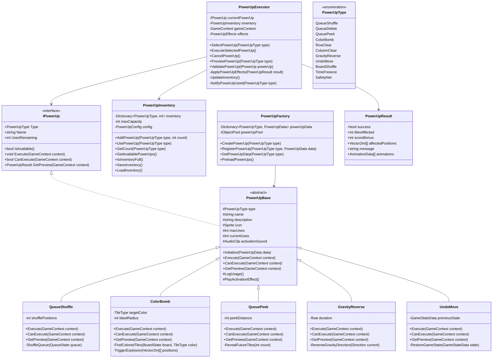
```mermaid
classDiagram
    class IPowerUp {
        <<interface>>
        +PowerUpType Type
        +string Name
        +int UsesRemaining
        +bool IsAvailable()
        +void Execute(GameContext context)
        +bool CanExecute(GameContext context)
        +PowerUpResult GetPreview(GameContext context)
    }
    
    class PowerUpBase {
        <<abstract>>
        #PowerUpType type
        #string name
        #string description
        #Sprite icon
        #int maxUses
        #int currentUses
        #AudioClip activationSound
        +Initialize(PowerUpData data)
        +Execute(GameContext context)*
        +CanExecute(GameContext context)*
        +GetPreview(GameContext context)*
        #LogUsage()
        #PlayActivationEffect()
    }
    
    class QueueShuffle {
        -int shufflePositions
        +Execute(GameContext context)
        +CanExecute(GameContext context)
        +GetPreview(GameContext context)
        -ShuffleQueue(QueueState queue)
    }
    
    class ColorBomb {
        -TileType targetColor
        -int blastRadius
        +Execute(GameContext context)
        +CanExecute(GameContext context)
        +GetPreview(GameContext context)
        -FindColoredTiles(BoardState board, TileType color)
        -TriggerExplosion(Vector2Int[] positions)
    }
    
    class QueuePeek {
        -int peekDistance
        +Execute(GameContext context)
        +CanExecute(GameContext context)
        +GetPreview(GameContext context)
        -RevealFutureTiles(int count)
    }
    
    class GravityReverse {
        -float duration
        +Execute(GameContext context)
        +CanExecute(GameContext context)
        +GetPreview(GameContext context)
        -ReverseGravityDirection(Direction current)
    }
    
    class UndoMove {
        -GameStateData previousState
        +Execute(GameContext context)
        +CanExecute(GameContext context)
        +GetPreview(GameContext context)
        -RestoreGameState(GameStateData state)
    }
    
    class PowerUpExecutor {
        -IPowerUp currentPowerUp
        -PowerUpInventory inventory
        -GameContext gameContext
        -PowerUpEffects effects
        +SelectPowerUp(PowerUpType type)
        +ExecuteSelectedPowerUp()
        +CancelPowerUp()
        +PreviewPowerUp(PowerUpType type)
        +ValidatePowerUp(IPowerUp powerUp)
        -ApplyPowerUpEffects(PowerUpResult result)
        -UpdateInventory()
        -NotifyPowerUpUsed(PowerUpType type)
    }
    
    class PowerUpInventory {
        -Dictionary~PowerUpType, int~ inventory
        -int maxCapacity
        -PowerUpConfig config
        +AddPowerUp(PowerUpType type, int count)
        +UsePowerUp(PowerUpType type)
        +GetCount(PowerUpType type)
        +GetAvailablePowerUps()
        +IsInventoryFull()
        +SaveInventory()
        +LoadInventory()
    }
    
    class PowerUpFactory {
        -Dictionary~PowerUpType, PowerUpData~ powerUpData
        -IObjectPool powerUpPool
        +CreatePowerUp(PowerUpType type)
        +RegisterPowerUp(PowerUpType type, PowerUpData data)
        +GetPowerUpData(PowerUpType type)
        +PreloadPowerUps()
    }
    
    class PowerUpResult {
        +bool success
        +int tilesAffected
        +int scoreBonus
        +Vector2Int[] affectedPositions
        +string message
        +AnimationData[] animations
    }
    
    class PowerUpType {
        <<enumeration>>
        QueueShuffle
        QueueDelete
        QueuePeek
        ColorBomb
        RowClear
        ColumnClear
        GravityReverse
        UndoMove
        BoardShuffle
        TimeFreeeze
        SafetyNet
    }
    
    IPowerUp <|.. PowerUpBase
    PowerUpBase <|-- QueueShuffle
    PowerUpBase <|-- ColorBomb
    PowerUpBase <|-- QueuePeek
    PowerUpBase <|-- GravityReverse
    PowerUpBase <|-- UndoMove
    PowerUpExecutor --> IPowerUp
    PowerUpExecutor --> PowerUpInventory
    PowerUpFactory --> PowerUpBase
    PowerUpExecutor --> PowerUpResult
```

### 3.11 Tutorial & Hint System Classes
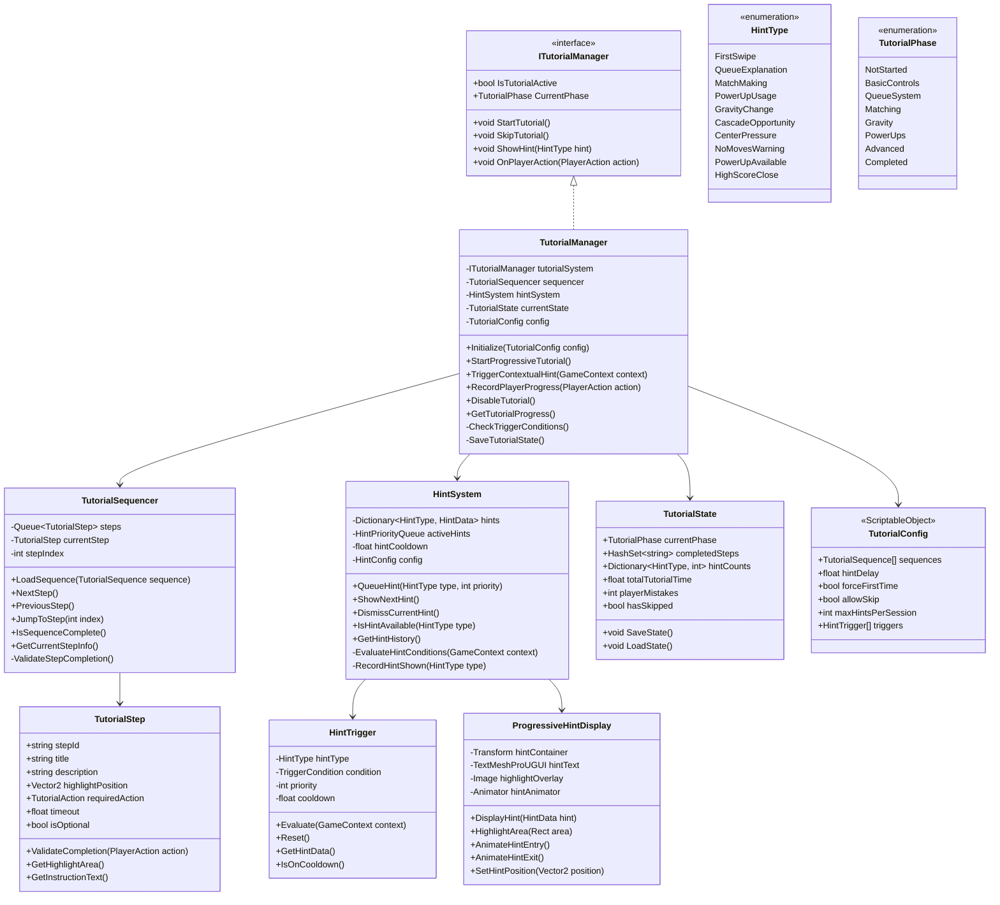
```mermaid
classDiagram
    class ITutorialManager {
        <<interface>>
        +bool IsTutorialActive
        +TutorialPhase CurrentPhase
        +void StartTutorial()
        +void SkipTutorial()
        +void ShowHint(HintType hint)
        +void OnPlayerAction(PlayerAction action)
    }
    
    class TutorialManager {
        -ITutorialManager tutorialSystem
        -TutorialSequencer sequencer
        -HintSystem hintSystem
        -TutorialState currentState
        -TutorialConfig config
        +Initialize(TutorialConfig config)
        +StartProgressiveTutorial()
        +TriggerContextualHint(GameContext context)
        +RecordPlayerProgress(PlayerAction action)
        +DisableTutorial()
        +GetTutorialProgress()
        -CheckTriggerConditions()
        -SaveTutorialState()
    }
    
    class TutorialSequencer {
        -Queue~TutorialStep~ steps
        -TutorialStep currentStep
        -int stepIndex
        +LoadSequence(TutorialSequence sequence)
        +NextStep()
        +PreviousStep()
        +JumpToStep(int index)
        +IsSequenceComplete()
        +GetCurrentStepInfo()
        -ValidateStepCompletion()
    }
    
    class HintSystem {
        -Dictionary~HintType, HintData~ hints
        -HintPriorityQueue activeHints
        -float hintCooldown
        -HintConfig config
        +QueueHint(HintType type, int priority)
        +ShowNextHint()
        +DismissCurrentHint()
        +IsHintAvailable(HintType type)
        +GetHintHistory()
        -EvaluateHintConditions(GameContext context)
        -RecordHintShown(HintType type)
    }
    
    class TutorialStep {
        +string stepId
        +string title
        +string description
        +Vector2 highlightPosition
        +TutorialAction requiredAction
        +float timeout
        +bool isOptional
        +ValidateCompletion(PlayerAction action)
        +GetHighlightArea()
        +GetInstructionText()
    }
    
    class HintTrigger {
        -HintType hintType
        -TriggerCondition condition
        -int priority
        -float cooldown
        +Evaluate(GameContext context)
        +Reset()
        +GetHintData()
        +IsOnCooldown()
    }
    
    class ProgressiveHintDisplay {
        -Transform hintContainer
        -TextMeshProUGUI hintText
        -Image highlightOverlay
        -Animator hintAnimator
        +DisplayHint(HintData hint)
        +HighlightArea(Rect area)
        +AnimateHintEntry()
        +AnimateHintExit()
        +SetHintPosition(Vector2 position)
    }
    
    class TutorialState {
        +TutorialPhase currentPhase
        +HashSet~string~ completedSteps
        +Dictionary~HintType, int~ hintCounts
        +float totalTutorialTime
        +int playerMistakes
        +bool hasSkipped
        +void SaveState()
        +void LoadState()
    }
    
    class HintType {
        <<enumeration>>
        FirstSwipe
        QueueExplanation
        MatchMaking
        PowerUpUsage
        GravityChange
        CascadeOpportunity
        CenterPressure
        NoMovesWarning
        PowerUpAvailable
        HighScoreClose
    }
    
    class TutorialPhase {
        <<enumeration>>
        NotStarted
        BasicControls
        QueueSystem
        Matching
        Gravity
        PowerUps
        Advanced
        Completed
    }
    
    class TutorialConfig {
        <<ScriptableObject>>
        +TutorialSequence[] sequences
        +float hintDelay
        +bool forceFirstTime
        +bool allowSkip
        +int maxHintsPerSession
        +HintTrigger[] triggers
    }
    
    ITutorialManager <|.. TutorialManager
    TutorialManager --> TutorialSequencer
    TutorialManager --> HintSystem
    TutorialManager --> TutorialState
    TutorialSequencer --> TutorialStep
    HintSystem --> HintTrigger
    HintSystem --> ProgressiveHintDisplay
    TutorialManager --> TutorialConfig
```

### 3.12 UI System Architecture
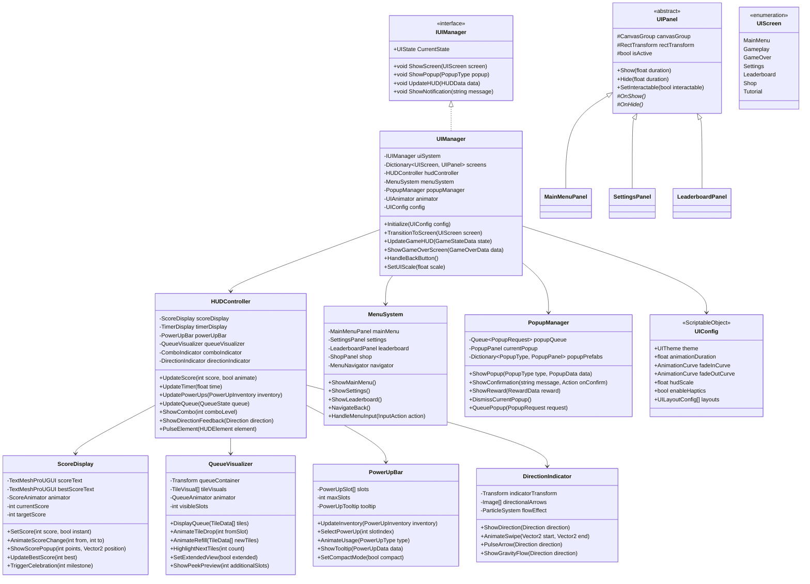
```mermaid
classDiagram
    class IUIManager {
        <<interface>>
        +UIState CurrentState
        +void ShowScreen(UIScreen screen)
        +void ShowPopup(PopupType popup)
        +void UpdateHUD(HUDData data)
        +void ShowNotification(string message)
    }
    
    class UIManager {
        -IUIManager uiSystem
        -Dictionary~UIScreen, UIPanel~ screens
        -HUDController hudController
        -MenuSystem menuSystem
        -PopupManager popupManager
        -UIAnimator animator
        -UIConfig config
        +Initialize(UIConfig config)
        +TransitionToScreen(UIScreen screen)
        +UpdateGameHUD(GameStateData state)
        +ShowGameOverScreen(GameOverData data)
        +HandleBackButton()
        +SetUIScale(float scale)
    }
    
    class HUDController {
        -ScoreDisplay scoreDisplay
        -TimerDisplay timerDisplay
        -PowerUpBar powerUpBar
        -QueueVisualizer queueVisualizer
        -ComboIndicator comboIndicator
        -DirectionIndicator directionIndicator
        +UpdateScore(int score, bool animate)
        +UpdateTimer(float time)
        +UpdatePowerUps(PowerUpInventory inventory)
        +UpdateQueue(QueueState queue)
        +ShowCombo(int comboLevel)
        +ShowDirectionFeedback(Direction direction)
        +PulseElement(HUDElement element)
    }
    
    class ScoreDisplay {
        -TextMeshProUGUI scoreText
        -TextMeshProUGUI bestScoreText
        -ScoreAnimator animator
        -int currentScore
        -int targetScore
        +SetScore(int score, bool instant)
        +AnimateScoreChange(int from, int to)
        +ShowScorePopup(int points, Vector2 position)
        +UpdateBestScore(int best)
        +TriggerCelebration(int milestone)
    }
    
    class QueueVisualizer {
        -Transform queueContainer
        -TileVisual[] tileVisuals
        -QueueAnimator animator
        -int visibleSlots
        +DisplayQueue(TileData[] tiles)
        +AnimateTileDrop(int fromSlot)
        +AnimateRefill(TileData[] newTiles)
        +HighlightNextTiles(int count)
        +SetExtendedView(bool extended)
        +ShowPeekPreview(int additionalSlots)
    }
    
    class MenuSystem {
        -MainMenuPanel mainMenu
        -SettingsPanel settings
        -LeaderboardPanel leaderboard
        -ShopPanel shop
        -MenuNavigator navigator
        +ShowMainMenu()
        +ShowSettings()
        +ShowLeaderboard()
        +NavigateBack()
        +HandleMenuInput(InputAction action)
    }
    
    class PopupManager {
        -Queue~PopupRequest~ popupQueue
        -PopupPanel currentPopup
        -Dictionary~PopupType, PopupPanel~ popupPrefabs
        +ShowPopup(PopupType type, PopupData data)
        +ShowConfirmation(string message, Action onConfirm)
        +ShowReward(RewardData reward)
        +DismissCurrentPopup()
        +QueuePopup(PopupRequest request)
    }
    
    class PowerUpBar {
        -PowerUpSlot[] slots
        -int maxSlots
        -PowerUpTooltip tooltip
        +UpdateInventory(PowerUpInventory inventory)
        +SelectPowerUp(int slotIndex)
        +AnimateUsage(PowerUpType type)
        +ShowTooltip(PowerUpData data)
        +SetCompactMode(bool compact)
    }
    
    class DirectionIndicator {
        -Transform indicatorTransform
        -Image[] directionalArrows
        -ParticleSystem flowEffect
        +ShowDirection(Direction direction)
        +AnimateSwipe(Vector2 start, Vector2 end)
        +PulseArrow(Direction direction)
        +ShowGravityFlow(Direction direction)
    }
    
    class UIPanel {
        <<abstract>>
        #CanvasGroup canvasGroup
        #RectTransform rectTransform
        #bool isActive
        +Show(float duration)
        +Hide(float duration)
        +SetInteractable(bool interactable)
        #OnShow()*
        #OnHide()*
    }
    
    class UIConfig {
        <<ScriptableObject>>
        +UITheme theme
        +float animationDuration
        +AnimationCurve fadeInCurve
        +AnimationCurve fadeOutCurve
        +float hudScale
        +bool enableHaptics
        +UILayoutConfig[] layouts
    }
    
    class UIScreen {
        <<enumeration>>
        MainMenu
        Gameplay
        GameOver
        Settings
        Leaderboard
        Shop
        Tutorial
    }
    
    IUIManager <|.. UIManager
    UIManager --> HUDController
    UIManager --> MenuSystem
    UIManager --> PopupManager
    UIManager --> UIConfig
    HUDController --> ScoreDisplay
    HUDController --> QueueVisualizer
    HUDController --> PowerUpBar
    HUDController --> DirectionIndicator
    UIPanel <|-- MainMenuPanel
    UIPanel <|-- SettingsPanel
    UIPanel <|-- LeaderboardPanel
```

### 3.4 Queue System Architecture
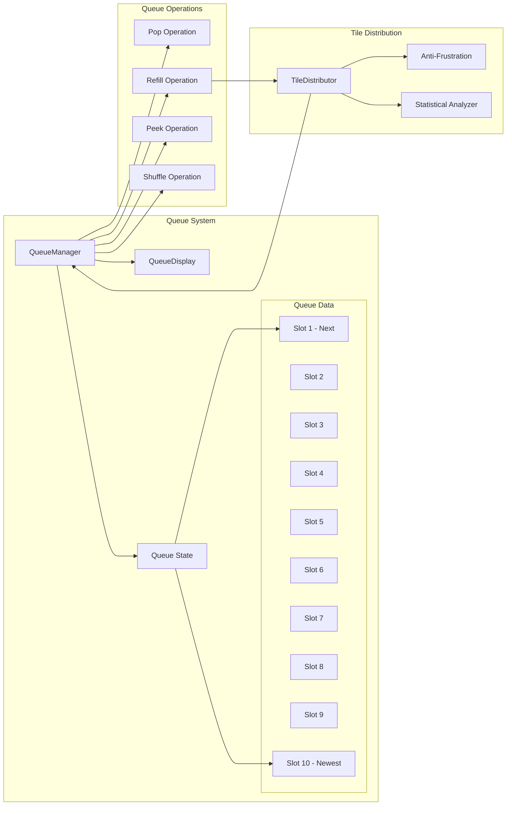
```mermaid
graph LR
    subgraph "Queue System"
        QM[QueueManager]
        QD[QueueDisplay]
        QS[Queue State]
        
        QM --> QS
        QM --> QD
        
        subgraph "Queue Data"
            Q1[Slot 1 - Next]
            Q2[Slot 2]
            Q3[Slot 3]
            Q4[Slot 4]
            Q5[Slot 5]
            Q6[Slot 6]
            Q7[Slot 7]
            Q8[Slot 8]
            Q9[Slot 9]
            Q10[Slot 10 - Newest]
        end
        
        QS --> Q1
        QS --> Q10
    end
    
    subgraph "Tile Distribution"
        TD[TileDistributor]
        AF[Anti-Frustration]
        SA[Statistical Analyzer]
        
        TD --> AF
        TD --> SA
    end
    
    subgraph "Queue Operations"
        PO[Pop Operation]
        RF[Refill Operation]
        PK[Peek Operation]
        SH[Shuffle Operation]
    end
    
    QM --> PO
    QM --> RF
    QM --> PK
    QM --> SH
    
    RF --> TD
    TD --> QM
```

## 4. Performance Systems

### 4.1 Object Pooling Architecture
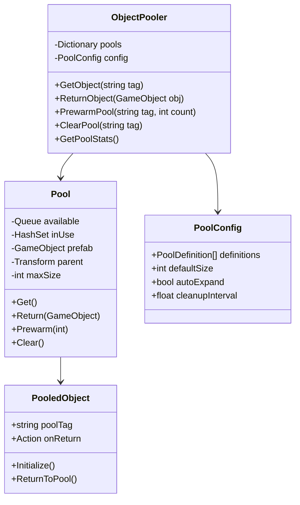
```mermaid
classDiagram
    class ObjectPooler {
        -Dictionary pools
        -PoolConfig config
        +GetObject(string tag)
        +ReturnObject(GameObject obj)
        +PrewarmPool(string tag, int count)
        +ClearPool(string tag)
        +GetPoolStats()
    }
    
    class Pool {
        -Queue available
        -HashSet inUse
        -GameObject prefab
        -Transform parent
        -int maxSize
        +Get()
        +Return(GameObject)
        +Prewarm(int)
        +Clear()
    }
    
    class PoolConfig {
        +PoolDefinition[] definitions
        +int defaultSize
        +bool autoExpand
        +float cleanupInterval
    }
    
    class PooledObject {
        +string poolTag
        +Action onReturn
        +Initialize()
        +ReturnToPool()
    }
    
    ObjectPooler --> Pool
    ObjectPooler --> PoolConfig
    Pool --> PooledObject
```

### 4.2 Animation System (Hybrid Approach)
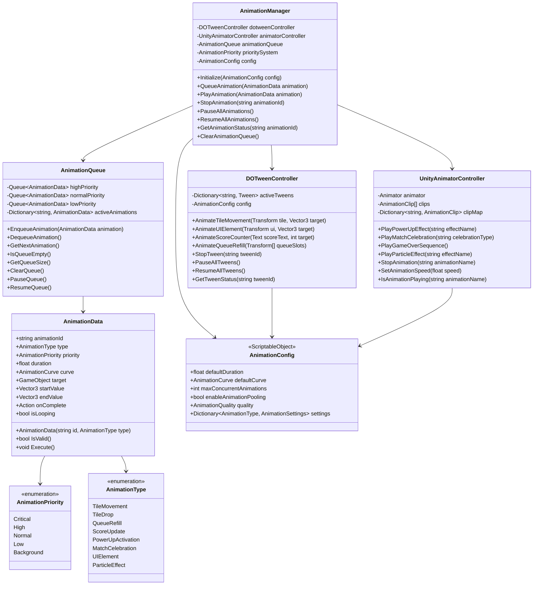
```mermaid
classDiagram
    class AnimationManager {
        -DOTweenController dotweenController
        -UnityAnimatorController animatorController
        -AnimationQueue animationQueue
        -AnimationPriority prioritySystem
        -AnimationConfig config
        +Initialize(AnimationConfig config)
        +QueueAnimation(AnimationData animation)
        +PlayAnimation(AnimationData animation)
        +StopAnimation(string animationId)
        +PauseAllAnimations()
        +ResumeAllAnimations()
        +GetAnimationStatus(string animationId)
        +ClearAnimationQueue()
    }
    
    class AnimationQueue {
        -Queue~AnimationData~ highPriority
        -Queue~AnimationData~ normalPriority
        -Queue~AnimationData~ lowPriority
        -Dictionary~string, AnimationData~ activeAnimations
        +EnqueueAnimation(AnimationData animation)
        +DequeueAnimation()
        +GetNextAnimation()
        +IsQueueEmpty()
        +GetQueueSize()
        +ClearQueue()
        +PauseQueue()
        +ResumeQueue()
    }
    
    class AnimationPriority {
        <<enumeration>>
        Critical
        High
        Normal
        Low
        Background
    }
    
    class AnimationData {
        +string animationId
        +AnimationType type
        +AnimationPriority priority
        +float duration
        +AnimationCurve curve
        +GameObject target
        +Vector3 startValue
        +Vector3 endValue
        +Action onComplete
        +bool isLooping
        +AnimationData(string id, AnimationType type)
        +bool IsValid()
        +void Execute()
    }
    
    class DOTweenController {
        -Dictionary~string, Tween~ activeTweens
        -AnimationConfig config
        +AnimateTileMovement(Transform tile, Vector3 target)
        +AnimateUIElement(Transform ui, Vector3 target)
        +AnimateScoreCounter(Text scoreText, int target)
        +AnimateQueueRefill(Transform[] queueSlots)
        +StopTween(string tweenId)
        +PauseAllTweens()
        +ResumeAllTweens()
        +GetTweenStatus(string tweenId)
    }
    
    class UnityAnimatorController {
        -Animator animator
        -AnimationClip[] clips
        -Dictionary~string, AnimationClip~ clipMap
        +PlayPowerUpEffect(string effectName)
        +PlayMatchCelebration(string celebrationType)
        +PlayGameOverSequence()
        +PlayParticleEffect(string effectName)
        +StopAnimation(string animationName)
        +SetAnimationSpeed(float speed)
        +IsAnimationPlaying(string animationName)
    }
    
    class AnimationConfig {
        <<ScriptableObject>>
        +float defaultDuration
        +AnimationCurve defaultCurve
        +int maxConcurrentAnimations
        +bool enableAnimationPooling
        +AnimationQuality quality
        +Dictionary~AnimationType, AnimationSettings~ settings
    }
    
    class AnimationType {
        <<enumeration>>
        TileMovement
        TileDrop
        QueueRefill
        ScoreUpdate
        PowerUpActivation
        MatchCelebration
        UIElement
        ParticleEffect
    }
    
    AnimationManager --> DOTweenController
    AnimationManager --> UnityAnimatorController
    AnimationManager --> AnimationQueue
    AnimationManager --> AnimationConfig
    AnimationQueue --> AnimationData
    AnimationData --> AnimationPriority
    AnimationData --> AnimationType
    DOTweenController --> AnimationConfig
    UnityAnimatorController --> AnimationConfig
```

### 4.2.1 Animation System Flow
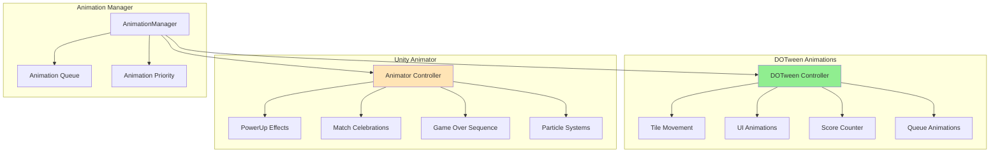
```mermaid
graph TD
    subgraph "DOTween Animations"
        DT[DOTween Controller]
        TM[Tile Movement]
        UIA[UI Animations]
        SC[Score Counter]
        QA[Queue Animations]
        
        DT --> TM
        DT --> UIA
        DT --> SC
        DT --> QA
    end
    
    subgraph "Unity Animator"
        UA[Animator Controller]
        PE[PowerUp Effects]
        MC[Match Celebrations]
        GO[Game Over Sequence]
        PS[Particle Systems]
        
        UA --> PE
        UA --> MC
        UA --> GO
        UA --> PS
    end
    
    subgraph "Animation Manager"
        AM[AnimationManager]
        AQ[Animation Queue]
        AP[Animation Priority]
        
        AM --> AQ
        AM --> AP
    end
    
    AM --> DT
    AM --> UA
    
    style DT fill:#90EE90
    style UA fill:#FFE4B5
```

### 4.3 Performance Monitoring System
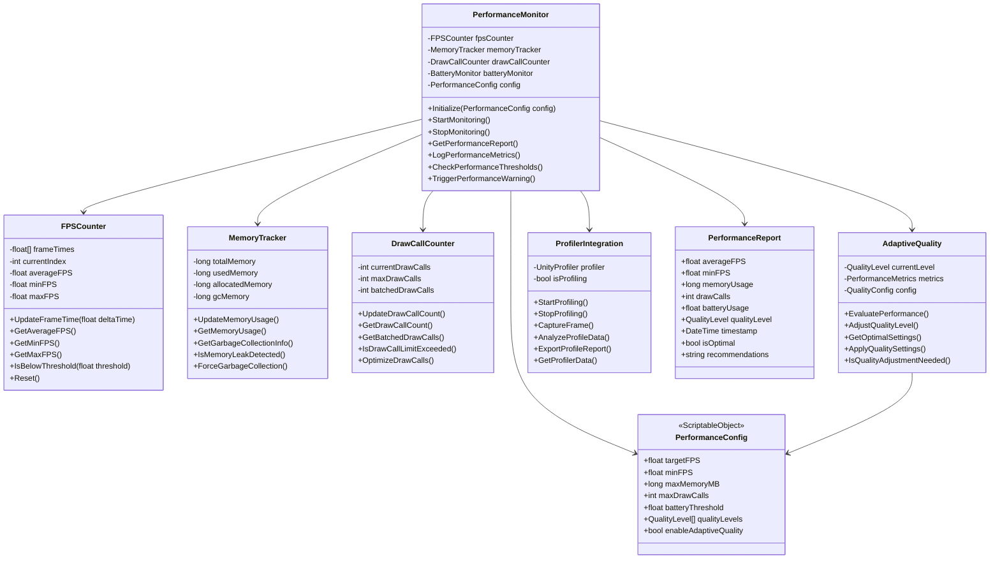
```mermaid
classDiagram
    class PerformanceMonitor {
        -FPSCounter fpsCounter
        -MemoryTracker memoryTracker
        -DrawCallCounter drawCallCounter
        -BatteryMonitor batteryMonitor
        -PerformanceConfig config
        +Initialize(PerformanceConfig config)
        +StartMonitoring()
        +StopMonitoring()
        +GetPerformanceReport()
        +LogPerformanceMetrics()
        +CheckPerformanceThresholds()
        +TriggerPerformanceWarning()
    }
    
    class FPSCounter {
        -float[] frameTimes
        -int currentIndex
        -float averageFPS
        -float minFPS
        -float maxFPS
        +UpdateFrameTime(float deltaTime)
        +GetAverageFPS()
        +GetMinFPS()
        +GetMaxFPS()
        +IsBelowThreshold(float threshold)
        +Reset()
    }
    
    class MemoryTracker {
        -long totalMemory
        -long usedMemory
        -long allocatedMemory
        -long gcMemory
        +UpdateMemoryUsage()
        +GetMemoryUsage()
        +GetGarbageCollectionInfo()
        +IsMemoryLeakDetected()
        +ForceGarbageCollection()
    }
    
    class DrawCallCounter {
        -int currentDrawCalls
        -int maxDrawCalls
        -int batchedDrawCalls
        +UpdateDrawCallCount()
        +GetDrawCallCount()
        +GetBatchedDrawCalls()
        +IsDrawCallLimitExceeded()
        +OptimizeDrawCalls()
    }
    
    class AdaptiveQuality {
        -QualityLevel currentLevel
        -PerformanceMetrics metrics
        -QualityConfig config
        +EvaluatePerformance()
        +AdjustQualityLevel()
        +GetOptimalSettings()
        +ApplyQualitySettings()
        +IsQualityAdjustmentNeeded()
    }
    
    class ProfilerIntegration {
        -UnityProfiler profiler
        -bool isProfiling
        +StartProfiling()
        +StopProfiling()
        +CaptureFrame()
        +AnalyzeProfileData()
        +ExportProfileReport()
        +GetProfilerData()
    }
    
    class PerformanceConfig {
        <<ScriptableObject>>
        +float targetFPS
        +float minFPS
        +long maxMemoryMB
        +int maxDrawCalls
        +float batteryThreshold
        +QualityLevel[] qualityLevels
        +bool enableAdaptiveQuality
    }
    
    class PerformanceReport {
        +float averageFPS
        +float minFPS
        +long memoryUsage
        +int drawCalls
        +float batteryUsage
        +QualityLevel qualityLevel
        +DateTime timestamp
        +bool isOptimal
        +string recommendations
    }
    
    PerformanceMonitor --> FPSCounter
    PerformanceMonitor --> MemoryTracker
    PerformanceMonitor --> DrawCallCounter
    PerformanceMonitor --> AdaptiveQuality
    PerformanceMonitor --> ProfilerIntegration
    PerformanceMonitor --> PerformanceConfig
    PerformanceMonitor --> PerformanceReport
    AdaptiveQuality --> PerformanceConfig
```

## 5. Save System & Simple Leaderboards

### 5.1 Simplified Save System
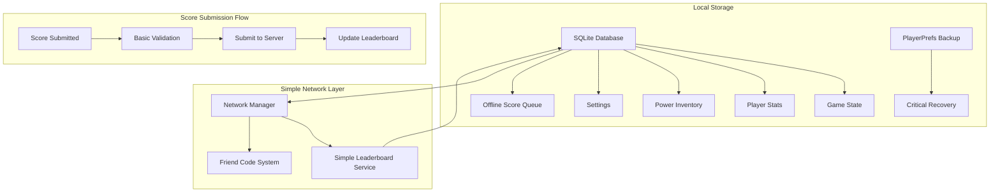
```mermaid
graph TB
    subgraph "Local Storage"
        SQL[SQLite Database]
        PP[PlayerPrefs Backup]
        
        SQL --> GS[Game State]
        SQL --> PS[Player Stats]
        SQL --> PI[Power Inventory]
        SQL --> ST[Settings]
        SQL --> OSQ[Offline Score Queue]
        
        PP --> CR[Critical Recovery]
    end
    
    subgraph "Simple Network Layer"
        NM[Network Manager]
        SLS[Simple Leaderboard Service]
        FC[Friend Code System]
        
        NM --> SLS
        NM --> FC
    end
    
    subgraph "Score Submission Flow"
        SC1[Score Submitted]
        SC2[Basic Validation]
        SC3[Submit to Server]
        SC4[Update Leaderboard]
        
        SC1 --> SC2
        SC2 --> SC3
        SC3 --> SC4
    end
    
    SQL --> NM
    SLS --> SQL
```

### 5.2 Simple Score Submission Protocol
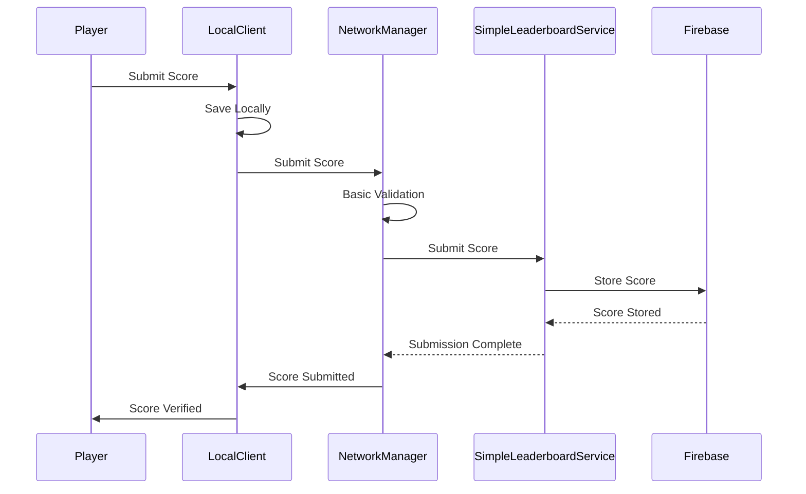
```mermaid
sequenceDiagram
    participant Player
    participant LocalClient
    participant NetworkManager
    participant SimpleLeaderboardService
    participant Firebase
    
    Player->>LocalClient: Submit Score
    LocalClient->>LocalClient: Save Locally
    LocalClient->>NetworkManager: Submit Score
    
    NetworkManager->>NetworkManager: Basic Validation
    NetworkManager->>SimpleLeaderboardService: Submit Score
    SimpleLeaderboardService->>Firebase: Store Score
    
    Firebase-->>SimpleLeaderboardService: Score Stored
    SimpleLeaderboardService-->>NetworkManager: Submission Complete
    NetworkManager->>LocalClient: Score Submitted
    LocalClient->>Player: Score Verified
```

### 5.3 Simple Leaderboard Service Classes
```mermaid
classDiagram
    class SimpleLeaderboardService {
        -FirebaseDatabase database
        -string playerId
        -string friendCode
        +GetTop100() LeaderboardEntry[]
        +SubmitScore(int score) bool
        +GetFriendsScores() LeaderboardEntry[]
        +GenerateFriendCode() string
        +AddFriend(string friendCode) bool
        +RemoveFriend(string friendCode) bool
        +GetPlayerRank(int score) int
    }
    
    class FriendCodeSystem {
        -string playerId
        -string friendCode
        -string[] friends
        +GenerateCode() string
        +ValidateCode(string code) bool
        +AddFriend(string code) bool
        +GetFriends() string[]
        +IsFriend(string playerId) bool
    }
    
    class LeaderboardEntry {
        +string playerId
        +string displayName
        +int score
        +long timestamp
        +string friendCode
        +LeaderboardEntry(string id, string name, int score)
        +bool IsValid()
        +string ToString()
    }
    
    class NetworkManager {
        -SimpleLeaderboardService leaderboardService
        -FriendCodeSystem friendSystem
        -bool isOnline
        +SubmitScore(int score) bool
        +GetLeaderboard() LeaderboardEntry[]
        +GetFriendsLeaderboard() LeaderboardEntry[]
        +ShareToSocial(int score) bool
        +CheckConnection() bool
    }
    
    SimpleLeaderboardService --> FriendCodeSystem
    SimpleLeaderboardService --> LeaderboardEntry
    NetworkManager --> SimpleLeaderboardService
    NetworkManager --> FriendCodeSystem
```

## 6. Audio System Architecture

### 6.1 Smart Audio Pooling
```mermaid
classDiagram
    class AudioManager {
        -AudioPool primaryPool
        -AudioPool secondaryPool
        -AudioSource musicSource
        -AudioSource notificationSource
        -AudioMixer masterMixer
        +PlaySound(AudioClip, Priority)
        +PlayMusic(AudioClip)
        +StopSound(int id)
        +SetVolume(float)
        +DuckAudio(float duration)
    }
    
    class AudioPool {
        -Queue sources
        -int maxSources
        -Priority priority
        +GetSource()
        +ReturnSource(AudioSource)
        +IsAvailable()
    }
    
    class AudioPriority {
        <<enumeration>>
        Critical
        High
        Normal
        Low
        Ambient
    }
    
    class AudioConfig {
        +int primaryPoolSize
        +int secondaryPoolSize
        +float duckingLevel
        +AnimationCurve fadeIn
        +AnimationCurve fadeOut
    }
    
    AudioManager --> AudioPool
    AudioManager --> AudioPriority
    AudioManager --> AudioConfig
    AudioPool --> AudioSource
```

## 7. Dependency Injection Architecture

### 7.1 DI Container Structure (Using VContainer)
```mermaid
classDiagram
    class IInstaller {
        <<interface>>
        +void Install(IContainerBuilder builder)
    }
    
    class GameInstaller {
        -GameConfig gameConfig
        -PerformanceConfig performanceConfig
        +void Install(IContainerBuilder builder)
        -void InstallCoreSystems(IContainerBuilder builder)
        -void InstallGameLogic(IContainerBuilder builder)
        -void InstallPerformanceSystems(IContainerBuilder builder)
    }
    
    class UIInstaller {
        -UIConfig uiConfig
        -AnimationConfig animationConfig
        +void Install(IContainerBuilder builder)
        -void InstallUISystems(IContainerBuilder builder)
        -void InstallAnimationSystems(IContainerBuilder builder)
        -void InstallInputSystems(IContainerBuilder builder)
    }
    
    class ServiceInstaller {
        -ServiceConfig serviceConfig
        +void Install(IContainerBuilder builder)
        -void InstallAudioServices(IContainerBuilder builder)
        -void InstallSaveServices(IContainerBuilder builder)
        -void InstallAnalyticsServices(IContainerBuilder builder)
    }
    
    class NetworkInstaller {
        -NetworkConfig networkConfig
        +void Install(IContainerBuilder builder)
        -void InstallNetworkServices(IContainerBuilder builder)
        -void InstallLeaderboardServices(IContainerBuilder builder)
        -void InstallSocialServices(IContainerBuilder builder)
    }
    
    class ScopeConfiguration {
        +Lifetime ProjectScope
        +Lifetime SceneScope
        +Lifetime TransientScope
        +void ConfigureScopes(IContainerBuilder builder)
        +void ConfigureInterfaceBindings(IContainerBuilder builder)
        +void ConfigureFactoryBindings(IContainerBuilder builder)
    }
    
    class InterfaceBindings {
        +IInputManager -> InputManager
        +IQueueSystem -> QueueManager
        +IMatchDetector -> MatchDetector
        +IGravitySystem -> DirectionalGravity
        +IAudioManager -> AudioManager
        +ISaveManager -> SaveManager
        +INetworkManager -> NetworkManager
    }
    
    class ConcreteBindings {
        +GameManager -> Singleton
        +BoardController -> SceneScope
        +PerformanceMonitor -> ProjectScope
        +AnimationManager -> SceneScope
        +ObjectPooler -> ProjectScope
    }
    
    class FactoryBindings {
        +TileFactory -> Transient
        +PowerUpFactory -> Transient
        +EffectFactory -> Transient
        +UIElementFactory -> Transient
    }
    
    IInstaller <|.. GameInstaller
    IInstaller <|.. UIInstaller
    IInstaller <|.. ServiceInstaller
    IInstaller <|.. NetworkInstaller
    
    GameInstaller --> ScopeConfiguration
    UIInstaller --> ScopeConfiguration
    ServiceInstaller --> ScopeConfiguration
    NetworkInstaller --> ScopeConfiguration
    
    ScopeConfiguration --> InterfaceBindings
    ScopeConfiguration --> ConcreteBindings
    ScopeConfiguration --> FactoryBindings
```

### 7.1.1 DI Container Flow
```mermaid
graph TB
    subgraph "Installers"
        GI[GameInstaller]
        UI[UIInstaller]
        SI[ServiceInstaller]
        NI[NetworkInstaller]
    end
    
    subgraph "Bindings"
        IB[Interface Bindings]
        CB[Concrete Bindings]
        FB[Factory Bindings]
        SB[Signal Bindings]
    end
    
    subgraph "Scopes"
        PS[Project Scope]
        SS[Scene Scope]
        TS[Transient Scope]
    end
    
    GI --> IB
    UI --> IB
    SI --> CB
    NI --> FB
    
    IB --> PS
    CB --> SS
    FB --> TS
    SB --> PS
    
    subgraph "Injected Systems"
        GM[GameManager]
        BC[BoardController]
        AM[AudioManager]
        SM[SaveManager]
    end
    
    PS --> GM
    SS --> BC
    PS --> AM
    PS --> SM
```

### 7.2 Testing Architecture
```mermaid
graph LR
    subgraph "Test Types"
        UT[Unit Tests]
        IT[Integration Tests]
        PT[Play Mode Tests]
        PE[Performance Tests]
    end
    
    subgraph "Mock Systems"
        MB[Mock Board]
        MI[Mock Input]
        MN[Mock Network]
        MS[Mock Save]
    end
    
    subgraph "Test Runners"
        TR[Test Runner]
        CI[CI/CD Pipeline]
        PR[Performance Profiler]
    end
    
    UT --> MB
    UT --> MI
    IT --> MN
    IT --> MS
    
    PT --> TR
    PE --> PR
    
    TR --> CI
    PR --> CI
```

## 8. Event System Architecture

### 8.1 Signal Bus Pattern
```mermaid
classDiagram
    class IEventBus {
        <<interface>>
        +Subscribe(Action handler)
        +Unsubscribe(Action handler)
        +Publish(T signal)
        +Clear()
    }
    
    class EventBus {
        -Dictionary subscribers
        +Subscribe(Action handler)
        +Unsubscribe(Action handler)
        +Publish(T signal)
        +Clear()
    }
    
    class GameSignals {
        <<signals>>
        +SwipeDetected
        +MatchFound
        +ScoreChanged
        +GameStateChanged
        +PowerUpActivated
        +TilePlaced
        +QueueUpdated
        +CascadeStarted
    }
    
    IEventBus <|.. EventBus
    EventBus --> GameSignals
```

## 9. Unity GameObject Hierarchy

### 9.1 Scene Structure
```mermaid
graph TD
    subgraph "DontDestroyOnLoad"
        GM[GameManager]
        AM[AudioManager]
        SM[SaveManager]
        NM[NetworkManager]
    end
    
    subgraph "Game Scene"
        GR[GameRoot]
        GR --> BC[BoardController]
        GR --> QS[QueueSystem]
        GR --> UI[UIRoot]
        GR --> FX[EffectsRoot]
        GR --> PL[Pools]
        
        BC --> BG[BoardGrid]
        BG --> T[Tiles 8x8]
        
        QS --> QD[QueueDisplay]
        QD --> QT[QueueTiles 10]
        
        UI --> HUD[HUDCanvas]
        UI --> MN[MenuCanvas]
        
        FX --> PS[ParticleSystems]
        FX --> AN[Animators]
        
        PL --> TP[TilePool]
        PL --> EP[EffectPool]
    end
```

## 10. Performance Optimization Strategy

### 10.1 Mobile Performance Targets
```mermaid
graph LR
    subgraph "Performance Metrics"
        FPS[60 FPS Target]
        MEM[<200MB Memory]
        BAT[<10% Battery/Hour]
        CPU[<30% CPU Usage]
        GPU[<40% GPU Usage]
    end
    
    subgraph "Optimization Techniques"
        OP[Object Pooling]
        TA[Texture Atlasing]
        LOD[LOD System]
        CL[Culling]
        BC[Batch Calls]
    end
    
    subgraph "Monitoring"
        PR[Unity Profiler]
        FM[Frame Debugger]
        MM[Memory Profiler]
        DV[Device Testing]
    end
    
    FPS --> OP
    MEM --> TA
    BAT --> LOD
    CPU --> CL
    GPU --> BC
    
    OP --> PR
    TA --> FM
    LOD --> MM
    CL --> DV
    BC --> DV
```

## 11. Implementation Priority

### Phase 1: Core Systems (Sprint 1)

- DI Container Setup
- GameManager with State Machine
- BoardController with Grid
- Basic Input System
- Object Pooling

### Phase 2: Game Mechanics (Sprint 2)

- Gravity System
- Queue System
- Match Detection
- Tile Distribution
- Basic Animations

### Phase 3: Features (Sprint 3)

- Power-Up System
- Save System
- Audio Manager
- Tutorial System
- UI Polish

### Phase 4: Social & Polish (Sprint 4)

- Simple Leaderboard System
- Friend Code System
- Social Media Sharing
- Analytics Integration
- Ad Service
- Performance Optimization

## 12. Architecture Benefits

### Technical Benefits

- **Testability**: Full DI enables comprehensive testing
- **Performance**: Pooling and optimization for 60 FPS
- **Scalability**: Modular design supports feature additions
- **Maintainability**: Clear separation of concerns

### Portfolio Benefits

- **Modern Patterns**: DI, State Machine, Event Bus
- **Innovation**: Directional gravity system, friend codes, social sharing
- **Professional**: Industry-standard architecture
- **Complete**: Full-stack game development

### Development Benefits

- **Rapid Iteration**: Modular systems enable quick changes
- **Team Ready**: Clear interfaces for collaboration
- **Debug Friendly**: Event system aids troubleshooting
- **CI/CD Ready**: Automated testing support

---

**Document Version**: 1.0  
**Date**: January 2025  
**Status**: Approved for Implementation
